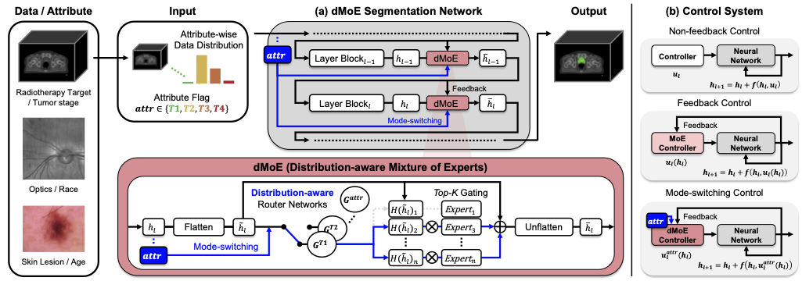

# Distribution-aware Fairness Learning in Medical Image Segmentation From A Control-Theoretic Perspective (ICML 2025, Spotlight)

Authors: Yujin Oh*, Pengfei Jin*, Sangjoon Park*, Sekeun Kim, Siyeop Yoon, Kyungsang Kim, Jin Sung Kim, Xiang Li**, Quanzheng Li**

*Equal contribution
**Corresponding authors

https://arxiv.org/abs/2502.00619

---

> **Abstract:** Ensuring fairness in medical image segmentation is critical due to biases in imbalanced clinical data acquisition caused by demographic attributes (e.g., age, sex, race) and clinical factors (e.g., disease severity). To address these challenges, we introduce Distribution-aware Mixture of Experts (dMoE), inspired by optimal control theory. We provide a comprehensive analysis of its underlying mechanisms and clarify dMoE's role in adapting to heterogeneous distributions in medical image segmentation. Furthermore, we integrate dMoE into multiple network architectures, demonstrating its broad applicability across diverse medical image analysis tasks. By incorporating demographic and clinical factors, dMoE achieves state-of-the-art performance on two 2D benchmark datasets and a 3D in-house dataset. Our results highlight the effectiveness of dMoE in mitigating biases from imbalanced distributions, offering a promising approach to bridging control theory and medical image segmentation within fairness learning paradigms. 
>
> <p align="center">
> 
> </p>

## News
* [2025.05.01] Our paper is accepted on ICML2025, Spotlight Poster.
* [2025.05.22] Source codes and checkpoints for 2D are released.
* [2025.05.27] Python codes for 3D model architecture are released.

## Pretrained models:

|     Dataset     |   Setting    |    Model Zoo   |  Results   |
| :-------------: | :---------:  | :--------------------: | :--------------------: |
| 2D FairSeg |  dMoE   |  [checkpoint](https://drive.google.com/file/d/1Bu_Zz9gSnSGy5wHon-fT9iSwV-OuFAHo/view?usp=sharing) |  [Rim Results](https://drive.google.com/file/d/1DBfnmK7_Gn5m1GDNyclFTvWKbb05GTOC/view?usp=sharing) [Cup Results](https://drive.google.com/file/d/1nt1S90IYBjJ5woouNbDBg8wOjZvTe48M/view?usp=sharing)  |
| 2D HAM10000 | dMoE | [checkpoint](https://drive.google.com/file/d/18Gmmlnwn5hT_jliKWxSxzKR7soCXHb3l/view?usp=sharing)  | [Results](https://drive.google.com/file/d/17xmxx6dZrOT3xo7MLUj4eDIPT9CzEYFS/view?usp=sharing)   |

## Inference:
 `bash 2d/test.sh`
 
 `bash 2d/test_ham.sh`

## analysis:
 `python 2d/analysis/ensemble.py`

## Related Assets & Acknowledgement:
Our work builds upon the following valuable resources, which have significantly influenced our implementation. We extend our sincere gratitude to the original authors.
 - FairSeg: [GitHub](https://github.com/Harvard-Ophthalmology-AI-Lab/FairSeg)
 - HAM10000: [Dataset](https://datasetninja.com/skin-cancer-ham10000)
 
## Citation:
```
@misc{oh2025distributionawarefairnesslearningmedical,
      title={Distribution-aware Fairness Learning in Medical Image Segmentation From A Control-Theoretic Perspective}, 
      author={Yujin Oh and Pengfei Jin and Sangjoon Park and Sekeun Kim and Siyeop Yoon and Kyungsang Kim and Jin Sung Kim and Xiang Li and Quanzheng Li},
      year={2025},
      eprint={2502.00619},
      archivePrefix={arXiv},
      primaryClass={eess.IV},
      url={https://arxiv.org/abs/2502.00619}, 
}
```
